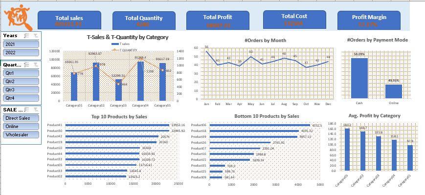

# 🛒 Sales Performance Dashboard



## 📝 Overview  
This dashboard provides a comprehensive analysis of sales performance, highlighting key metrics and trends across categories, products, and sales channels. It is designed to help businesses track performance and make data-driven decisions.

### Key Metrics  
- 💰 **Total Sales**: Overview of revenue generated.  
- 📦 **Total Quantity**: Total units sold.  
- 📈 **Total Profit**: Net earnings after costs.  
- 💸 **Total Cost**: Total expenditure on goods or services.  
- 📊 **Profit Margin**: Percentage of profitability.  

---

## 🔍 Features  
- **Sales and Quantity by Category**: Visual comparison of sales and quantities sold for each category.  
- **Orders by Month**: Monthly trends in order volume.  
- **Orders by Payment Mode**: Breakdown of cash vs. online payments.  
- **Top and Bottom 10 Products**: Performance ranking of best- and worst-selling products.  
- **Average Profit by Category**: Insights into category-level profitability.  

---

## 💡 Use Cases  
This dashboard is ideal for:  
1. **Sales Teams**: To monitor product and category performance.  
2. **Managers**: To evaluate profitability and cost efficiency.  
3. **Business Owners**: To make informed decisions on pricing, inventory, and sales strategies.  

---

## 🛠 How to Use  
1. Clone this repository to your local machine:  
   ```bash
   git clone https://github.com/yourusername/sales-performance-dashboard.git
